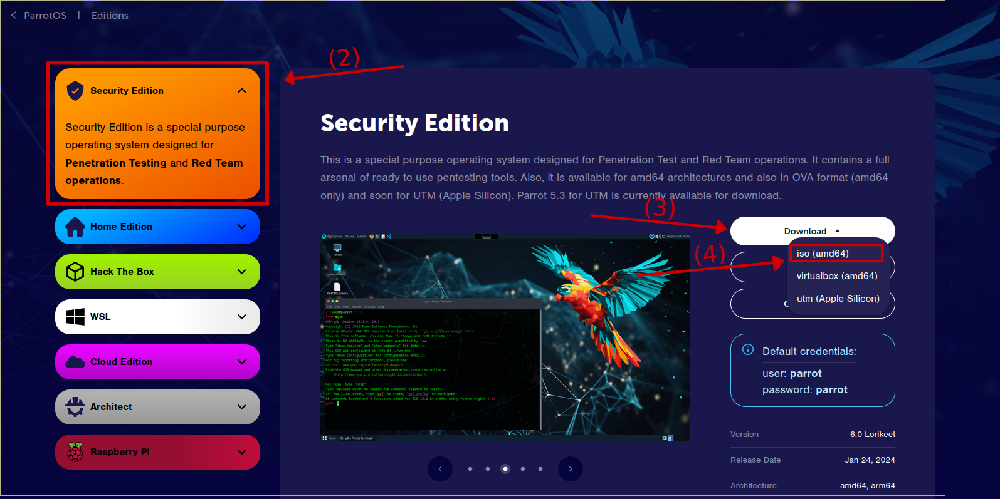
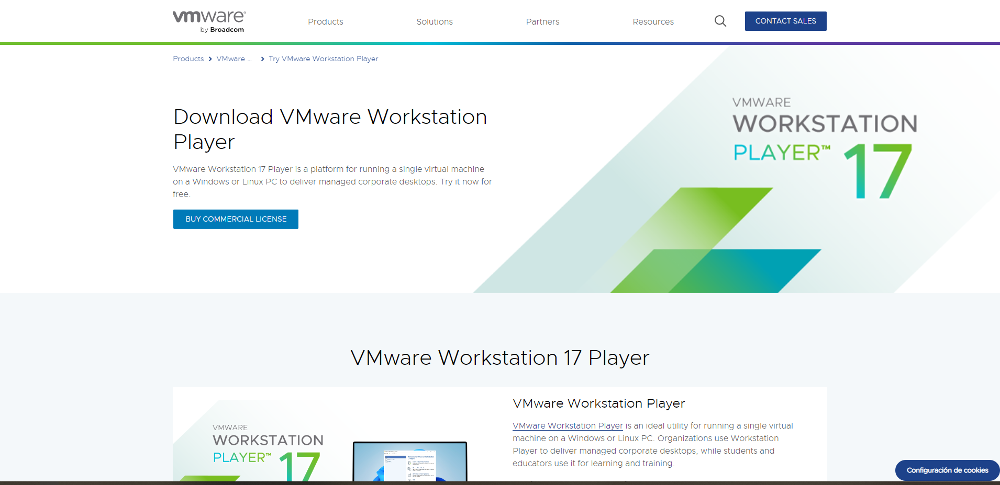
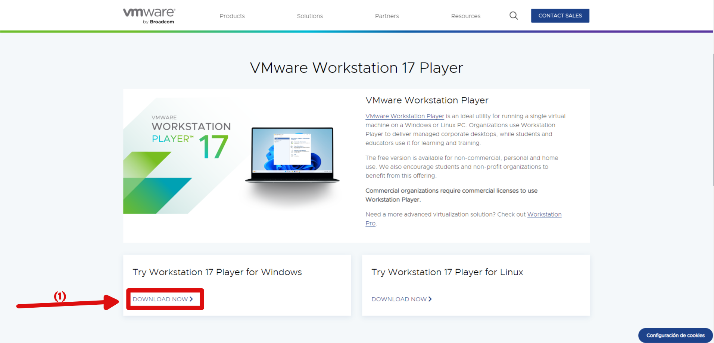
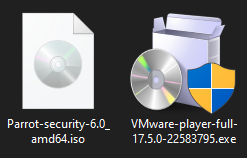
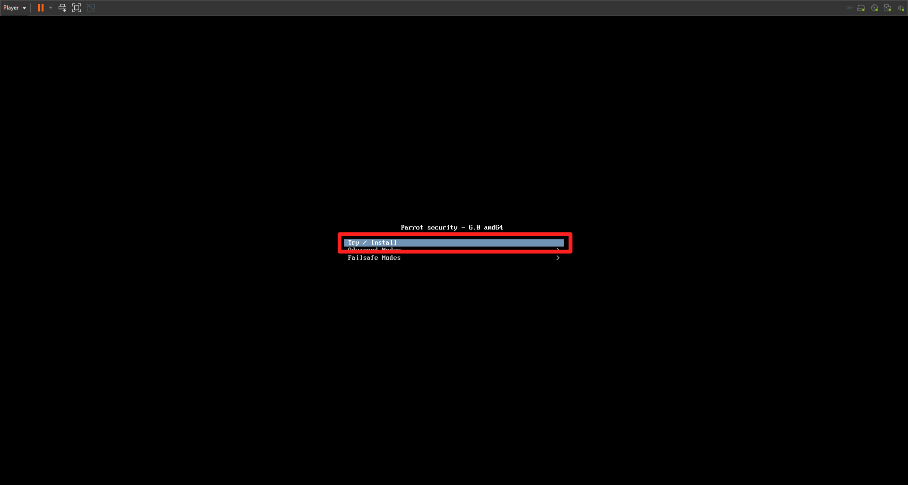
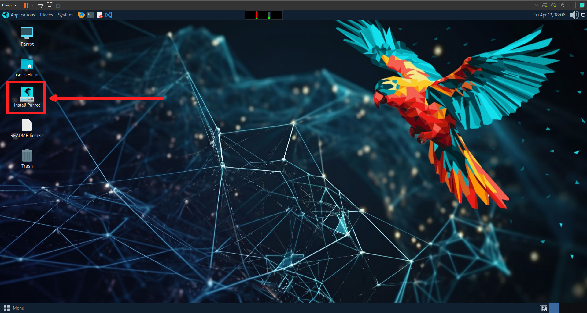

# OverTheWire

Over the wire is a platform that allows learn and practice security concepts through games. In this guide we are going to solve the wargames step by step adding some theory that cam help you to improve your skills and knowledge in cebersecurity.

## Guides list

[requirements]: (##requirements)
[bandit]: /games/BANDIT.md
[natas]: /games/NATAS.md 

| Guide                | Link                                     |
| -------------------- |:----------------------------------------:|
| **Installing Linux** | [Requirements guide][requirements]       |
| **Bandit**           | [Bandit Guide][bandit]                   |
| **Natas**            | [Natas Guide][natas]                     |

## Guide language

* [Español](Guides/README_es.md)
* [English](README.md)

## Requirements

### How to install Linux on a VM

#### First step: Downloading the iso

First of all we must install the iso. For these tutorials we are goint to use **Parrot Ofensive security**, so we are going to access to the follow link:

https://www.parrotsec.org/

(1) Now are going to click in any of the download buttons.

(2) For all the options we are going to select the **Security Edition**.

(3) We are going to click on download.

(4) And finally choose the `iso(amd 64)` file.

#### Second step: Downloading the virtual machine

Also we need a virtual machine because it will be the software where we are going to run the iso. For this tutorial we are going to use VMWare Workstation Player, so click on the follow link to install the .exe:

https://www.vmware.com/products/workstation-player/workstation-player-evaluation.html.html

(1) We are going to scroll bar and click on the **Downloand now** button.

#### Third step: Verify the installation

  

#### Fourth step: Installing VMWare Workstation Player

(1) Click on the **next** button.

(2) Enable the terms option.

(3) click on **next** button

(optional) You can change location where the program is going to be installed.

(4) Enable the **Add to the path** option.

(5) (6) (7) Click on the **next** button.

(8) Click on the **install** button.

(9) Just wait the installation.

(10) Verify the installation

#### Fifth step: Installing the iso on the virual machine

(1) Click on the **Create a new virtual machine** option.

(2) We must select the path of the iso.

(3) We can change the name of our virtual machine.

(optional) We can change the location of our installation.

(4) Click on the **next** button.

(customizable) We can select the store of our virtual machine. For these tutorial we are going to use `20.00GB` and select **Split virtual disk into multiple files** option.

(5) Click on the **next** button.

(customizable) We can custom our virtual machine hardware. and the **custom window** is going to appear.

(6) Finally click on the **finish** button.

#### Sixth step: Installing parrot

The OS(operating system) is going to appear and we are going to select the **try/install** option and press enter.

The parrot try version is going to appear and we must click on **Install Parrot**.

