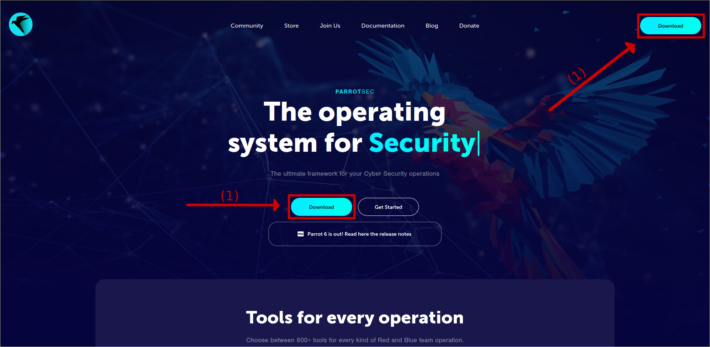

# OverTheWire

Over the wire is a platform that allows learn and practice security concepts through games. In this guide we are going to solve the wargames step by step adding some 
theory that cam help you to improve your skills and knowledge in cebersecurity.

## Guides list

[requirements]: (##requirements)
[bandit]: /games/BANDIT.md
[natas]: /games/NATAS.md 

| Guide                | Link                                     |
| -------------------- |:----------------------------------------:|
| **Installing Linux** | [Requirements guide][requirements]       |
| **Bandit**           | [Bandit Guide][bandit]                   |
| **Natas**            | [Natas Guide][natas]                     |

## Guide language

* [Español](Guides/README_es.md)
* [English](README.md)

## Requirements

### How to install Linux on a VM

#### First step: Downloading the iso

First of all we must install the iso. For these tutorials we are goint to use **Parrot Ofensive security**, so we are going to access to the follow link:

https://www.parrotsec.org/

(1) Now are going to click in any of the download buttons.

(2) For all the options we are going to select the **Security Edition**.

(3) We are going to click on download.

(4) And finally choose the `iso(amd 64)` file.

#### Second step: Downloading the virtual machine

We are going to use VMWare Workstation Player, so click on the follow link to install the .exe:

https://www.vmware.com/products/workstation-player/workstation-player-evaluation.html.html

(1) We are going to scroll bar and click on the **Downloand now** button.

#### Third step: Verify the installation

  

#### Fourth step: Installing VMWare Workstation Player

(1) Click on the **next** button.

(2) Accept the terms.

(3) click on **next** button

